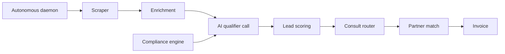

# WC Lead-Gen

> Autonomous lead generation and partner recruitment for workers' comp premium audits.

An end to end system that finds qualifying small businesses, qualifies them with an AI voice agent, recruits audit firm partners, and routes the consults between them. It runs as an autonomous daemon with compliance, monitoring, and self healing built in.

> This repository is an architecture overview. The production code, prompts, and data are private.

## How it works

## Stack

**Backend** &nbsp; Python
**Voice and AI** &nbsp; VAPI, LLMs
**Automation** &nbsp; Playwright scraping, autonomous daemon, watchdog
**Data** &nbsp; SQLite, Google Sheets
**Cloud** &nbsp; AWS EC2 and S3, SES, Resend
**Ops** &nbsp; Telegram bot, web dashboard
**Quality** &nbsp; ML scoring, anomaly detection, A/B testing

## Engineering highlights

- A fully autonomous daemon that scrapes, enriches, qualifies, routes, and recovers on its own, with a watchdog that restarts stalled work.
- A compliance engine: DNC suppression, PII redaction, spam trap filtering, and a tamper evident audit log.
- VAPI account pooling and provisioning, with health checks and self healing across the pool.
- An ML layer for lead scoring, call quality analytics, and anomaly detection, plus A/B testing on messaging.
- Property based, chaos, and integration test suites for resilience under failure.
- A Telegram ops bot and a web dashboard for live monitoring and control.

## Status

Built, autonomous, and deployed on EC2.

---

Part of the work of [Denis Redzic](https://denis.denisai.online).
